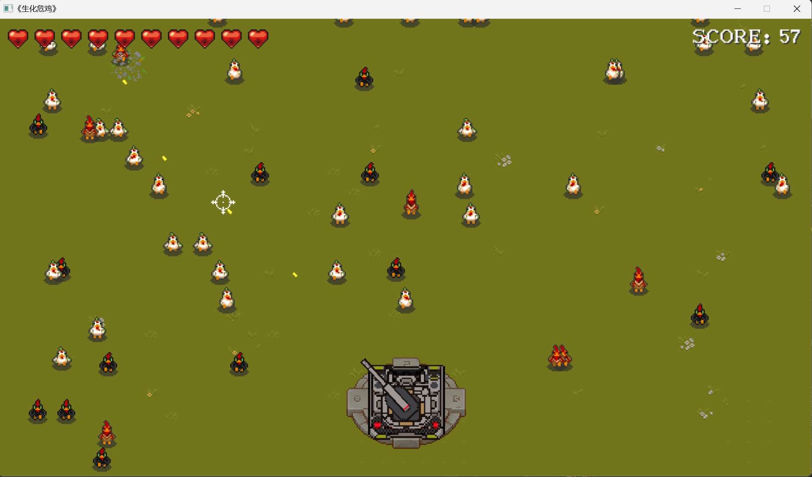
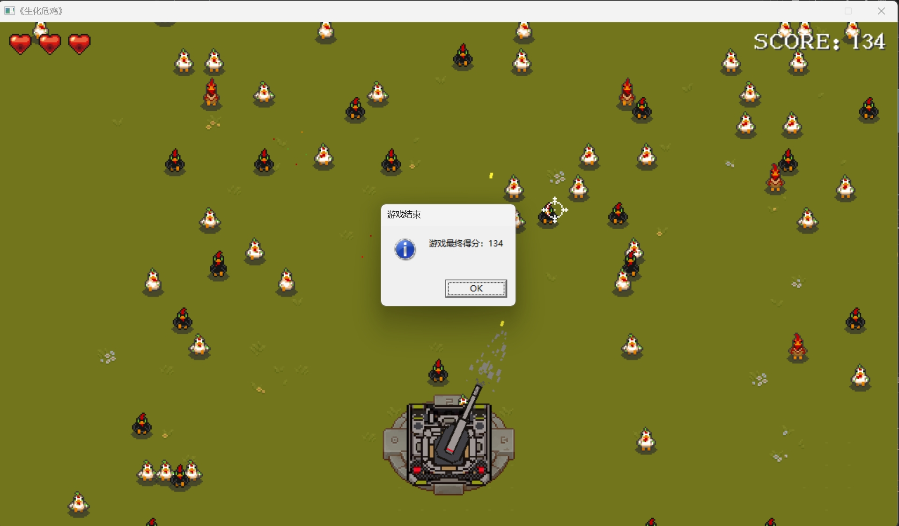

# C++游戏开发 + SDL
## 《生化危鸡》

> from Voidmatrix in Bilibili  [BV1wDUcYBEQB](https://www.bilibili.com/video/BV1wDUcYBEQB)

生化危鸡是一个鼠标射击游戏。根据回调函数Lambda表达式每隔1.5f随机概率生成fast chicken、medium chicken 和 slow chicken。子弹击中小鸡后，计数。当小鸡走出屏幕，则血量扣除。

- 鼠标悬停位置为射击准星，按鼠标左键射出子弹

> 游戏界面

> 失败界面

### 从项目中学到的东西
- SDL模式下，拥有性能与兼容性具佳的多种解决方案

### 未来想做的
- 给单机游戏设置多阶段
    - 加弹窗或者其他方式
    - 不同阶段的鸡的生成速度和生成概率不一样
    - 当然火力也有可能不一样
    - 加入累计积分排行系统，如果可能，玩家可以自己输入用户名